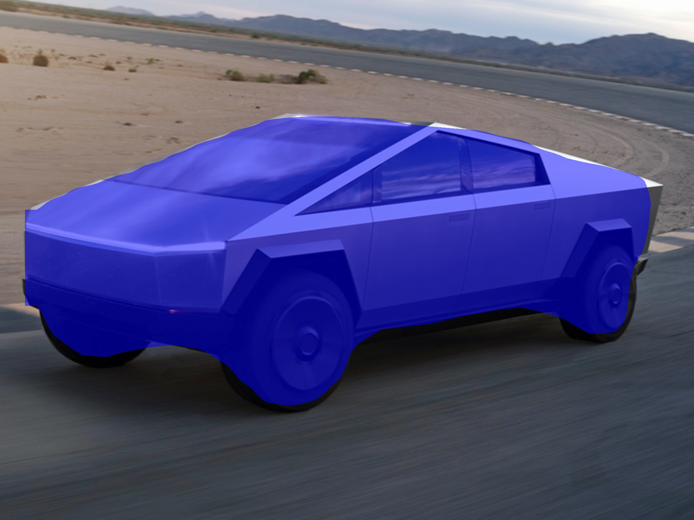

# Frozen-Graph-Inference-MaskRCNN
Semantic Segmentation [MaskRCNN] using Frozen graph for inference . The repository contains code to freeze a Keras .h5 model [.h5 to .pb] and inference using the frozen model.
## MaskRCNN Architecture
[Mask R-CNN](https://arxiv.org/abs/1703.06870) is built on [ResNet 101](https://arxiv.org/abs/1512.03385) backbone and Feature Pyramidal Network [FPN](https://arxiv.org/abs/1612.03144) .
## Dependencies
TensorFlow v1.x , pycocotools , OpenCV ,
GPU [>= 4 GB RAM] .
The Keras model [.h5] requires more than 4GB RAM . The frozen model can be loaded in less than 4GB memory .
## Instructions

Download COCO MaskRCNN trained model from [here](https://github.com/matterport/Mask_RCNN/releases) . Save in the main directory.

**Freeze Model** as follows . 
```
python freeze_model.py
```
**For Inference**
Provide path to frozen model and test image
```
python main.py -m model/mask_frozen_graph.pb -p test_image/tesla_cybertruck_F.jpg
```

Example Inference
 <br />
